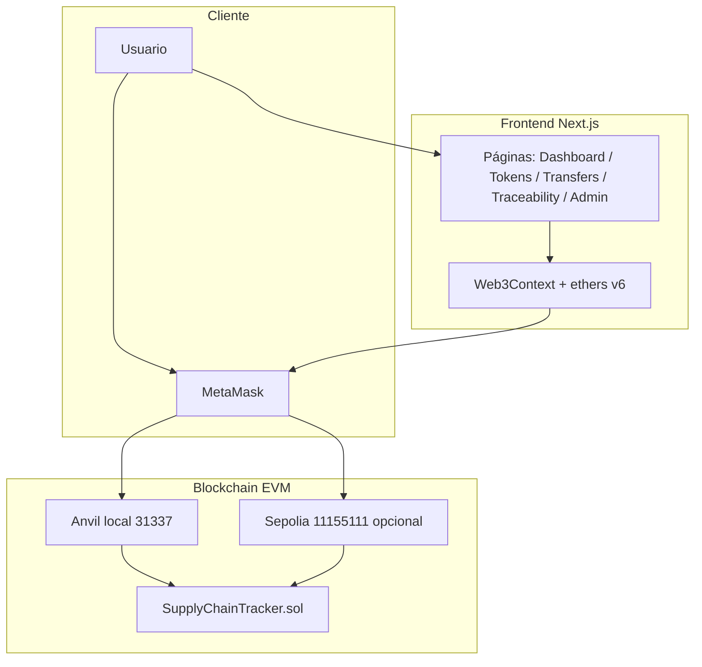
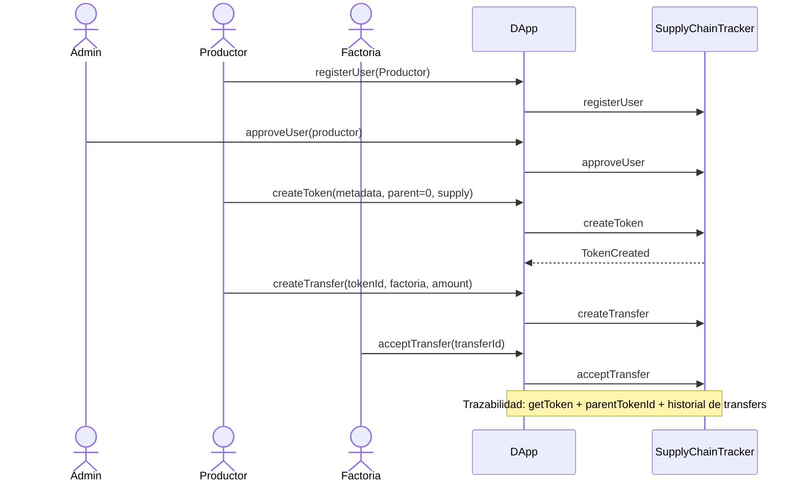
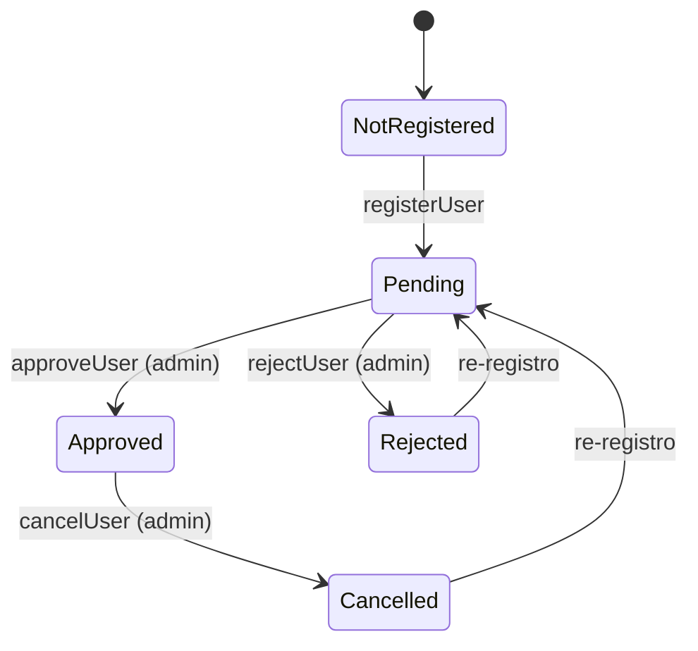
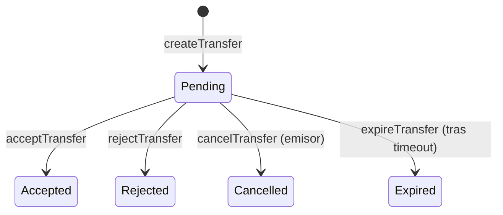

# Diagramas técnicos del proyecto

## 1. Arquitectura del sistema

```mermaid
flowchart TB
  subgraph Client["Cliente"]
    U[Usuario]
    MM[MetaMask]
  end

  subgraph DApp["Frontend Next.js"]
    UI[Páginas: Dashboard / Tokens / Transfers / Traceability / Admin]
    W3[Web3Context + ethers v6]
  end

  subgraph Chain["Blockchain EVM"]
    ANV[Anvil local 31337]
    SEP[Sepolia 11155111 opcional]
    SC[SupplyChainTracker.sol]
  end

  U --> UI
  U --> MM
  UI --> W3
  W3 --> MM
  MM --> ANV
  MM --> SEP
  ANV --> SC
  SEP --> SC
```

## 2. Flujo de datos / proceso de negocio

```mermaid
sequenceDiagram
  actor Admin
  actor Productor
  actor Factoria
  participant DApp
  participant Contrato as SupplyChainTracker

  Productor->>DApp: registerUser(Productor)
  DApp->>Contrato: registerUser
  Admin->>DApp: approveUser(productor)
  DApp->>Contrato: approveUser

  Productor->>DApp: createToken(metadata, parent=0, supply)
  DApp->>Contrato: createToken
  Contrato-->>DApp: TokenCreated

  Productor->>DApp: createTransfer(tokenId, factoria, amount)
  DApp->>Contrato: createTransfer
  Factoria->>DApp: acceptTransfer(transferId)
  DApp->>Contrato: acceptTransfer

  Note over DApp,Contrato: Trazabilidad: getToken + parentTokenId + historial de transfers
```

## 3. Roles y estados de usuario

```mermaid
stateDiagram-v2
  [*] --> NotRegistered
  NotRegistered --> Pending: registerUser
  Pending --> Approved: approveUser (admin)
  Pending --> Rejected: rejectUser (admin)
  Approved --> Cancelled: cancelUser (admin)
  Rejected --> Pending: re-registro
  Cancelled --> Pending: re-registro
```

## 4. Transferencia de token

```mermaid
stateDiagram-v2
  [*] --> Pending: createTransfer
  Pending --> Accepted: acceptTransfer
  Pending --> Rejected: rejectTransfer
  Pending --> Cancelled: cancelTransfer (emisor)
  Pending --> Expired: expireTransfer (tras timeout)
```
